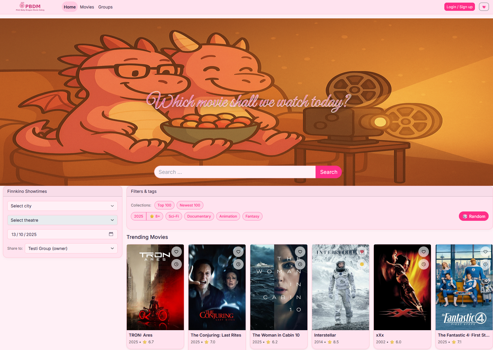
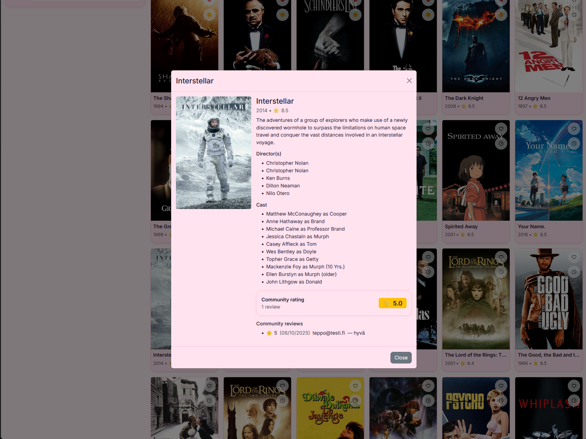
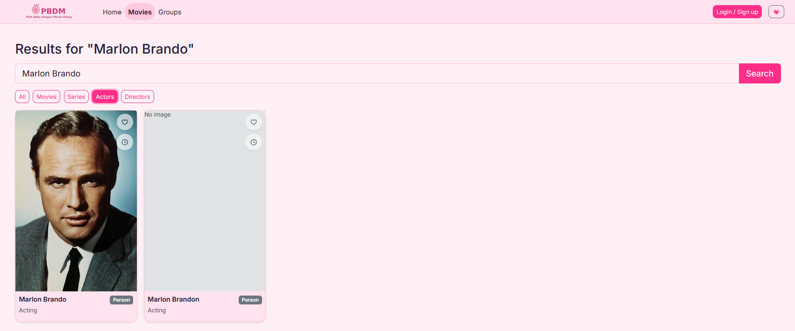
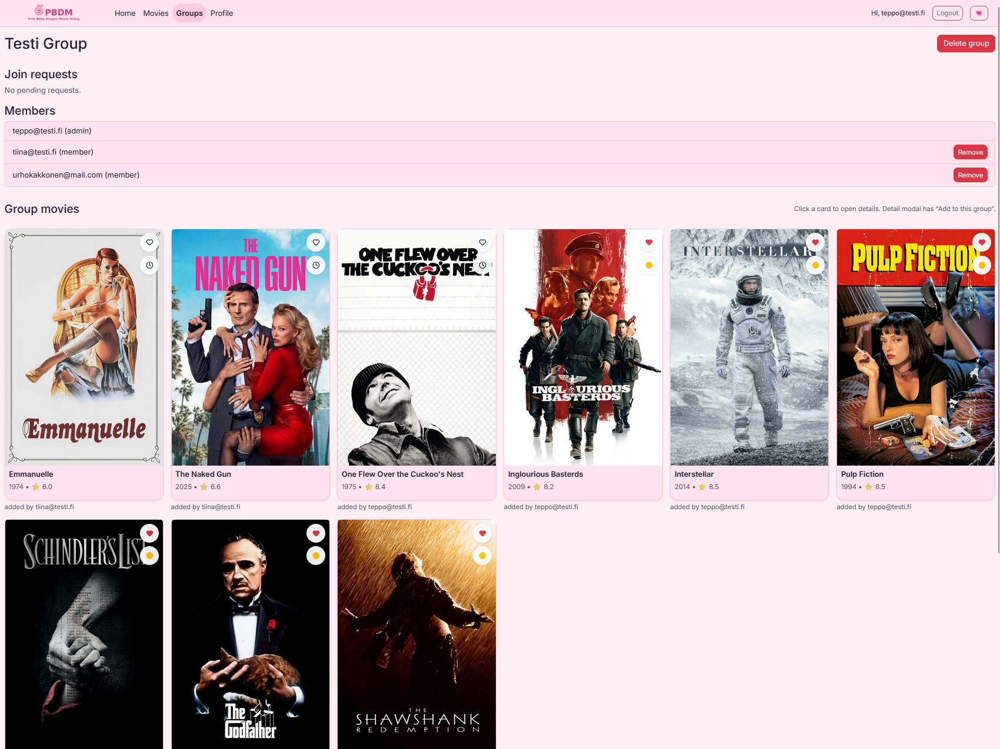
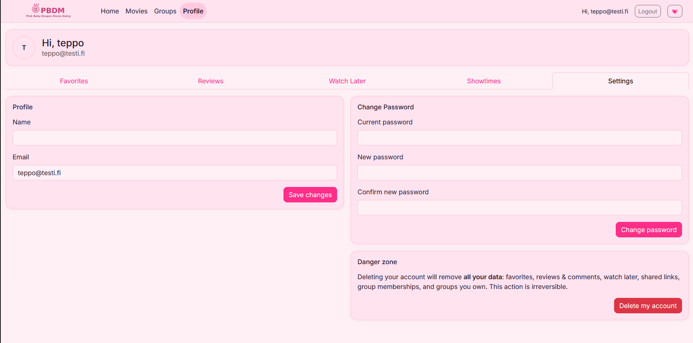

# 🎬 Pink Baby Dragon Movie Hub (PBDM)

A full-stack **movie community web application** built with **React**, **Node.js/Express**, and **PostgreSQL**.  
Created as part of the **Web Programming Project (Oulu University of Applied Sciences, Autumn 2024)**.

**Live demo:** [https://leffasivusto-front.onrender.com](https://leffasivusto-front.onrender.com)  
**GitHub repo:** [Web-ohjelmoinnin-sprojekti-Group-11/leffasivusto](https://github.com/Web-ohjelmoinnin-sprojekti-Group-11/leffasivusto)

---

## 🌟 Overview

Pink Baby Dragon Movie Hub (PBDM) is a responsive movie platform for film lovers.  
Users can register, search and review movies, create and customize groups, manage favorites and watch-later lists, and browse Finnkino showtimes.  
The app combines **TMDB** and **Finnkino** open data APIs, with authentication handled via **JWT** + refresh tokens.

---

## 🖼️ User Interface Preview

### Home page

### Movie details modal

### Search results

### Group view

### Profile & settings

---

## ⚙️ Technologies

**Frontend**
- React (Vite)
- React Router DOM (BrowserRouter)
- Axios for HTTP requests
- Bootstrap CSS
- Declarative programming style, functional components and state hooks

**Backend**
- Node.js + Express
- PostgreSQL with `pg`
- JWT + bcrypt for authentication
- Cookie-parser and CORS configuration
- Mocha + Chai (Supertest) for REST API testing
- MVC architecture (Model – Controller – View)

---

## 🧩 Features

| Category | Description |
|-----------|-------------|
| **Authentication** | Register, login, refresh token autologin, logout |
| **Profile management** | Change email and password, delete account (deep delete removes all user data) |
| **Search & Filters** | Search by title, actor, director + multi-filter system (year, rating, genre, collections) |
| **Movie details** | TMDB integration with cast, director and rating information |
| **Reviews** | Add text and 1-5 ⭐ rating; community average displayed |
| **Groups** | Create groups, join requests, add or remove members, add movies to group page |
| **Favorites & Watch-Later** | Personal lists visible on profile page |
| **Finnkino showtimes** | Browse cinemas by city and date |
| **Themes & UI** | Light/dark/pink theme switcher, random movie picker, responsive layout |

---

## 🗂️ Architecture

The project follows **MVC** structure for clear separation of concerns:

- **Model** – SQL queries and database logic (PostgreSQL)
- **Controller** – Request handling, validation, and error management (Express)
- **View** – React frontend rendering and state management
- **Middleware** – Authentication and error handlers

---

## 🔐 Security

- Passwords hashed with bcrypt  
- Access tokens expire and are recycled (refresh token via cookies)  
- Secure CORS and cookie settings between frontend and backend  
- Auth middleware protects restricted routes  

---

## 🧪 Testing

Automated REST API tests with Mocha + Chai cover:

- User registration and login  
- Logout and token verification  
- Review retrieval  
- Account deletion  

---

## 🧠 Scrum & Project Management

- **Scrum methodology:** Product backlog, sprints, daily meetings, retrospectives  
- **Documentation:**  
  - Product backlog (PDF)  
  - UI wireframes  
  - Class diagram and REST documentation ([Postman collection](https://documenter.getpostman.com/view/41366007/2sB3QKsqMR))  
  - Self & peer assessment form  

---

## 🚀 Deployment

- **Frontend:** React (Vite) deployed on Render  
- **Backend:** Express API + PostgreSQL deployed on Render  
- **Environment variables:** stored in `.env` (not committed)  

---

## 💡 Future Improvements

- AI-based movie recommendations  
- Comment threads under reviews  
- User-uploaded avatars  
- Group chat and notifications  

---

## ✅ Checklist of Required Functionalities (15/15)

| ID | Functionality | Description | Status |
|----|----------------|-------------|---------|
| 1 | Responsiveness | The interface scales smoothly across all screen sizes using Bootstrap grid and custom CSS. | ✅ |
| 2 | Registration | Users can create an account with email and validated password (8+ chars, one capital letter and number). | ✅ |
| 3 | Login | JWT authentication with refresh tokens and cookie-based session. | ✅ |
| 4 | Account deletion | User can permanently delete account; related data (reviews, favorites, groups) are removed (transactional deep delete). | ✅ |
| 5 | Search | Search by title, person, or genre with multiple filter options. | ✅ |
| 6 | Showtimes | Integrated Finnkino API for real-time theatre and showtime selection. | ✅ |
| 7 | Group page | Users can create groups, visible to others, with movies added collaboratively. | ✅ |
| 8 | Add member | Members can send and accept join requests to groups. | ✅ |
| 9 | Remove member | Group admins can remove members from their groups. | ✅ |
| 10 | Group customization | Group owners can manage their group content and details. | ✅ |
| 11 | Movie reviews | Users can add text and star-rated reviews; community average rating is shown. | ✅ |
| 12 | Review browsing | All reviews are visible under each movie’s details modal. | ✅ |
| 13 | Favorites | Logged-in users can mark and view their favorite movies. | ✅ |
| 14 | Sharing | Users can share movie links or group links with others. | ✅ |
| 15 | Extra feature | Theme switcher (light/dark/pink) and random movie picker added. | ✅ |

**All 15 required functionalities defined in the project instructions were implemented and demonstrated successfully.**

---

## 👩‍💻 Team 11

Developed at **Oulu University of Applied Sciences**, Autumn 2024.  
Frontend and backend built collaboratively by the team using GitHub and Scrum processes.

- **Joonas Väyrynen**
- **Tommi Järvenpää**
- **Miro Hovi**  
- **Antero Muunoja**

---

### 🩷 “Pink Baby Dragon Movie Hub – for those who watch together.”
